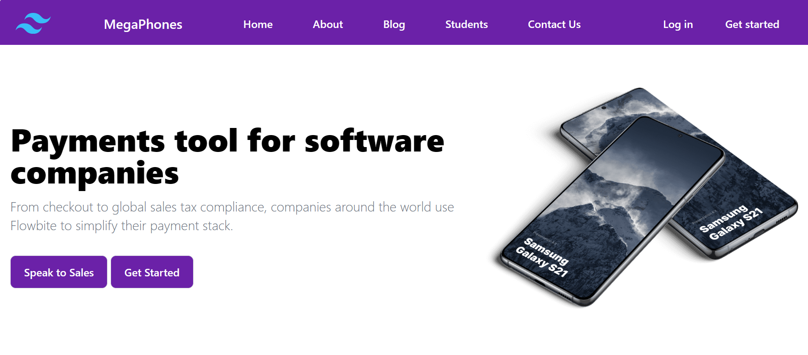
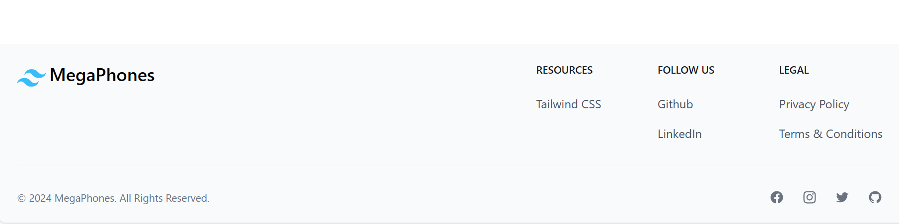

## Tailwind CSS Landing Page

This repository is an example of a responsive landing page  based on the Tailwind CSS framework and Flowbite library that you can use for your project.
## Live preview
Check out the live preview here:
[Landing page demo](https://landing-page-pied-beta-79.vercel.app/)
## Getting started
Make sure that you have Node.js, Tailwind CSS and Flowbite installed.
1. Run `npm install` inside your terminal
2. Watch for files and compile Tailwind CSS + Flowbite:
```
npx tailwindcss -i ./input.css -o ./output.css --watch
```
## Built with Flowbite Blocks
Get started with a huge collection of over 120+ website sections powered by Tailwind CSS and the Flowbite Library:
- 🔗 [Flowbite Blocks](https://flowbite.com/blocks/)
- 🔗 [Flowbite Library](https://flowbite.com/docs/getting-started/introduction/)
- 🔗 [Tailwind CSS](https://tailwindcss.com/)
## Screenshot
<a href="img/1.png" rel="some text"></a>
<a href="img/2.png" rel="some text"></a>